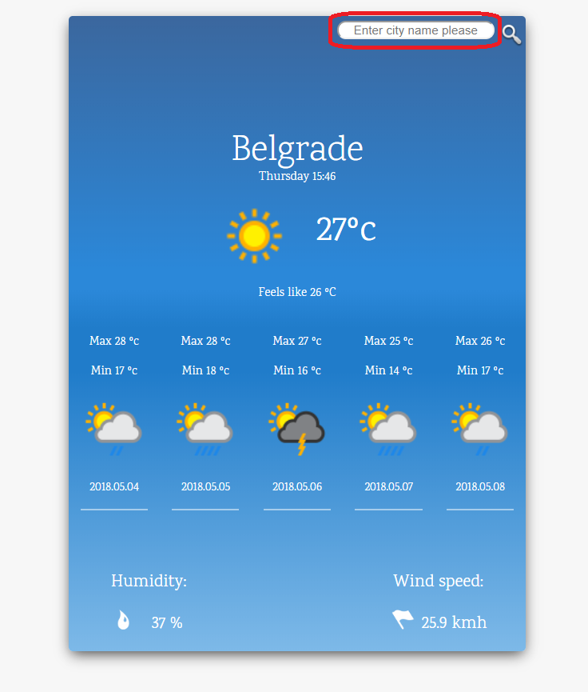
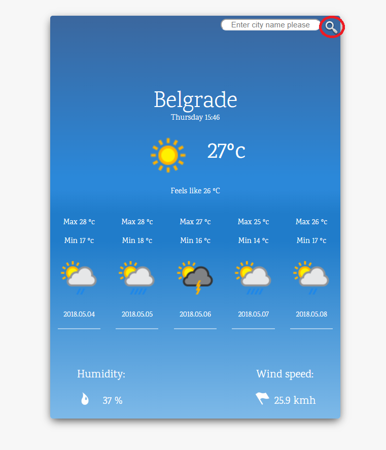
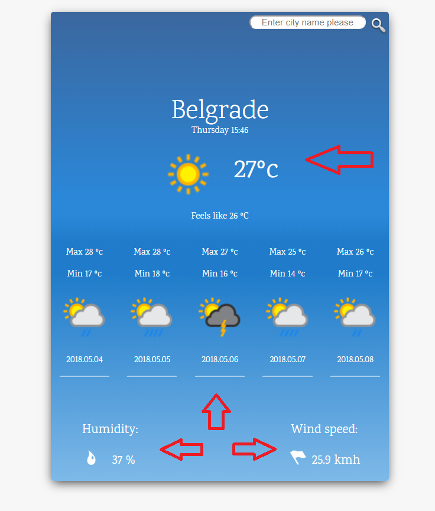

# Weather Forecast App

## Description
This is weather forecast app i build using html,css and javascript.In this case i used ReactJs javascript framework with axios client for promise requests.API used is from Apixu real time weather API and it was in JSON format, displaying current weather and next 5 days forecast.  Starting point is for Belgrade my home town.

## Installation
A step by step of examples  

*If you are using node package manager (npm) first step will be  

`npm install` 

Wait until instalation is finished and type 

`npm start` 

to start live server and preview of app   

*If you are using Yarn first step will be  

`yarn install` 

and after instalation 

`yarn run start` 

## Usage

* Put the city's name or its part and get the list of the most proper cities in the world. 
Example - Lon or Lond or London.
The more precise city name you put the more precise list you will get.  
  
* After you chose desired city click the search button in top right corner  
  
*It will show you current time and temperature in ºc with humidity level and wind speed. 
Also weather forecast for next 5 days   
  

## Built With

- React.JS - Javascript framework 
- Apixu - Real time weather API 
- Axios - HTTP client  
- PhpStorm - IDE 

## Author

- **Nikola Stanisavljevic** :+1:

